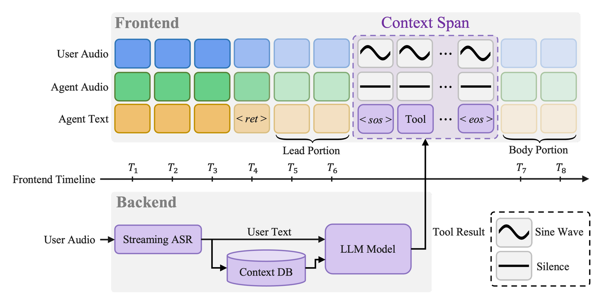
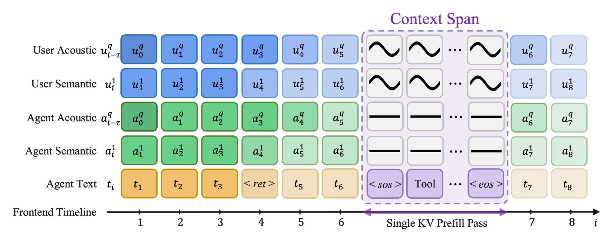

<div align="center">

  <h1>Context Spanning</h1>
  <h3>A Communication Framework for Full-Duplex Speech Models and External LLM Backends</h3>

  <br>

  <p>
    <b>Seonghyeon Go</b> &nbsp;•&nbsp; <b>Yongwoo Kim</b> &nbsp;•&nbsp; <b>Hyeonjin Cha</b> &nbsp;•&nbsp; <b>Jaeho Shin</b>
  </p>
  <p>
    <a href="https://mindlogic.ai">
      <picture>
        <source media="(prefers-color-scheme: dark)" srcset="assets/figures/mindlogic_logo_white.png">
        
      </picture>
    </a>
  </p>

  <br>

  [](https://arxiv.org/abs/XXXX.XXXXX) [](https://huggingface.co/mindlogicinc/context-spanning-7b) [](https://huggingface.co/nvidia/personaplex-7b-v1) [](LICENSE) [](https://www.nvidia.com/en-us/agreements/enterprise-software/nvidia-open-model-license/)

</div>

<p align="center">
  
</p>

Official PyTorch implementation of **Context Spanning**, a communication framework that lets a
full-duplex speech model call an external LLM backend (retrieval, tool calls, memory).

Code, the released **Context Spanning-7B** weights, the tool bank and the benchmark harness are all here.

Keywords: full-duplex spoken dialogue, speech-to-speech models, retrieval-augmented generation, tool calling

## Abstract

Full-duplex spoken dialogue models can listen and speak simultaneously like the real-time dynamics of
human conversation. For natural dialogue, the ability to search external information in real-time is also
an important capability. Many models remain trapped in parametric knowledge, leaving them unable to access
real-time information and tool execution. Furthermore, even when LLMs retrieve information, many models are
designed to reason over that information in the latent space rather than as-is, which can result in a loss
of detail. To address this issue, we propose **Context Spanning**, a framework for information exchange
between a full-duplex speech model and an external LLM backend. It feeds the retrieved information to the
speech model as-is, enabling it to reason over the information independently and generate responses. With
this approach, our model achieves high performance on everyday conversation in the Full-Duplex-Benchmark
and strong results on Question Answering tasks, demonstrating its potential.

## How it works

<p align="center">
  
</p>

A full-duplex speech model calls an external backend while it keeps listening and talking. When the
model emits `<ret>`, the recent user audio is transcribed, the backend returns reference, and that reference is written into the
model's context stream as a masked *Context Span* block at whatever frame it arrives. 


## Released Weights

**Context Spanning-7B** — [mindlogicinc/context-spanning-7b](https://huggingface.co/mindlogicinc/context-spanning-7b),
one checkpoint, `context_spanning_7b.pt` (`{"model": state_dict}` in bf16, 7B parameters, every parameter
fine-tuned from [`nvidia/personaplex-7b-v1`](https://huggingface.co/nvidia/personaplex-7b-v1); training
step 5,938 of the recipe in [`docs/TRAINING.md`](docs/TRAINING.md)). `main.py` fetches it when
`--checkpoint` is not given; the voice prompts `voices/*.pt` live in the same repository.

```bash
huggingface-cli download mindlogicinc/context-spanning-7b context_spanning_7b.pt --local-dir ckpt
python main.py infer --checkpoint ckpt/context_spanning_7b.pt --input-wav assets/test/question.wav --output-wav out.wav --voice f0
python main.py serve --checkpoint ckpt/context_spanning_7b.pt --voice f0
```

Every number below and in [`benchmark/results/`](benchmark/results/) is this checkpoint's unless the
row says otherwise.

### LoRA checkpoints

A checkpoint trained with LoRA adapters loads with the same `--checkpoint` flag. The adapters stay
unmerged (`<name>.base.weight`, `<name>.lora_A`, `<name>.lora_B` and `"lora": {"r", "alpha"}` in the
file); `contextspan/model/lora.py` rebuilds those layers at load and runs them as they were trained.
Unmerged adapters cost engine time: with r = 128 on 327 layers a step takes 88.8 ms against the 80 ms
frame (42.5 ms for a merged checkpoint), so a LoRA checkpoint is for `infer` and the benchmarks, not for
a live conversation.


## Results

The tables of the paper. Rows marked † are reprinted from the cited papers (MoshiRAG, PersonaPlex,
Full-Duplex-Bench); everything else was measured with the released checkpoint and this repository's
benchmark harness. Unless a row says otherwise the backend is Gemma-4-26B-A4B.

**Spoken QA and math reasoning (accuracy, %).** `ref.` = the injected reference judged against the gold
answer; `resp.` = the model's response. Following MoshiRAG's API-backend protocol, the pre-computed reference is
injected a fixed delay after `<ret>`: GPT-4.1 answered in 0.77 s on average in our runs, so the GPT-4.1 row uses a
0.8 s delay (MoshiRAG used 1.5 s). The math sets were unseen during training. Every set whole (LlamaQ 300,
WebQ 1,000, TriviaQA 1,000, HaluEval 1,000, math 3,822); MoshiRAG's judges (gemma-3-27b-it for HaluEval and math,
gpt-4o for the OpenAudioBench sets). Protocol and per-set reports: [`benchmark/README.md`](benchmark/README.md),
[`benchmark/results/`](benchmark/results/).

| Model | LlamaQ ref. | LlamaQ resp. | WebQ ref. | WebQ resp. | TriviaQA ref. | TriviaQA resp. | HaluEval ref. | HaluEval resp. |
|---|---:|---:|---:|---:|---:|---:|---:|---:|
| GLM-4-Voice† | | 64.7 | | 32.2 | | 39.1 | | 21.2 |
| STITCH-S† | | 73.3 | | 50.2 | | 50.0 | | – |
| MoshiRAG (Gemma 3)† | 83.0 | 80.3 | 71.5 | 67.2 | 73.7 | 69.6 | 42.0 | 36.3 |
| MoshiRAG (GPT-4.1)† | 87.8 | 80.6 | 77.7 | **68.9** | 86.8 | 78.2 | 61.2 | 51.3 |
| MoshiRAG (Tavily)† | 84.6 | 78.2 | 73.5 | 66.1 | 84.9 | 77.5 | 54.3 | 47.0 |
| Vanilla Moshi† | | 62.3 | | 26.6 | | 22.8 | | 10.5 |
| **Ours (Gemma 4)** | 85.3 | 81.7 | 67.7 | 59.1 | 71.5 | 68.9 | 39.6 | 33.7 |
| **Ours (GPT-4.1)** | 89.9 | **83.3** | 79.4 | 66.7 | 91.1 | **83.8** | 68.3 | **55.5** |

| Model | AddSub ref. | AddSub resp. | MultiArith ref. | MultiArith resp. | SinglEq ref. | SinglEq resp. | SVAMP ref. | SVAMP resp. | GSM8K ref. | GSM8K resp. |
|---|---:|---:|---:|---:|---:|---:|---:|---:|---:|---:|
| GLM-4-Voice† | | 59.4 | | 62.0 | | 71.0 | | 4.0 | | 29.0 |
| STITCH-S† | | **81.7** | | 87.9 | | **91.7** | | 72.2 | | 56.7 |
| MoshiRAG (Gemma 3)† | 76.6 | 61.7 | 87.1 | 69.0 | 83.2 | 68.2 | 74.1 | 55.0 | 66.2 | 33.9 |
| MoshiRAG (GPT-4.1)† | 87.9 | 64.8 | 87.1 | 76.0 | 89.6 | 72.9 | 80.5 | 61.1 | 70.8 | 43.2 |
| Vanilla Moshi† | | 8.3 | | 9.8 | | 18.4 | | 9.7 | | 2.1 |
| **Ours (Gemma 4)** | 78.5 | 76.2 | 94.5 | **89.7** | 82.1 | 77.6 | 86.0 | 81.1 | 70.4 | 62.5 |
| **Ours (GPT-4.1)** | 82.6 | 74.7 | 95.2 | **89.7** | 85.9 | 82.2 | 89.2 | **85.4** | 75.7 | **67.4** |

**Full-Duplex-Bench v1.** TOR = take-over rate (the fraction of clips in which the model takes the turn);
backchannel frequency is backchannels per second, JSD the Jensen-Shannon divergence from the human backchannel
timing distribution; latencies in seconds; the interruption response is rated by GPT-4o. Rows marked † are
reprinted from the PersonaPlex paper; Gemini is Gemini Live 2.5.

| Task | Metric | **Ours** | PersonaPlex† | Moshi† | Gemini† |
|---|---|---:|---:|---:|---:|
| Turn-Taking | TOR ↑ | 0.899 | 0.992 | 0.941 | 0.655 |
| | Latency, s ↓ | 0.064 | 0.070 | 0.265 | 1.301 |
| Pause Handling | TOR, Candor ↓ | 0.824 | 0.662 | 0.980 | 0.310 |
| | TOR, synthetic ↓ | 0.861 | 0.584 | 0.985 | 0.255 |
| Backchannel | TOR ↓ | 0.782 | 0.327 | 1.000 | 0.091 |
| | Frequency, per s ↑ | 0.150 | 0.025 | 0.001 | 0.012 |
| | JSD ↓ | 0.716 | 0.649 | 0.957 | 0.896 |
| User Interruption | TOR ↑ | 0.925 | 1.000 | 1.000 | 0.891 |
| | GPT-4o rating, 0–5 ↑ | 3.924 | 4.210 | 0.765 | 3.376 |
| | Latency, s ↓ | 0.598 | 0.400 | 0.257 | 1.183 |

**Full-Duplex-Bench v3 (tool calling under disfluency).** MoshiRAG is the released MoshiRAG checkpoint with the
Gemma-3-27B reference LLM under the same tool router and prompt. Tool selection, argument accuracy, response quality
and pass rate are fractions of the 100 scenarios; take-turn, interruption and filler rates are percentages; latency
is the task-completion time in seconds. Rows marked † are reprinted from the benchmark paper; GPT is GPT-Realtime,
Gemini is Gemini Live 3.1.

| Task | Metric | **Ours** | MoshiRAG | GPT† | Gemini† |
|---|---|---:|---:|---:|---:|
| Tool Use | Tool selection ↑ | 0.855 | 0.738 | 0.876 | 0.817 |
| | Argument accuracy ↑ | 0.567 | 0.440 | 0.680 | 0.588 |
| | Response quality ↑ | 0.411 | 0.255 | 0.792 | 0.718 |
| | Pass rate ↑ | 0.470 | 0.280 | 0.600 | 0.540 |
| Turn-Taking Dynamics | Take-turn rate, % ↑ | 95.0 | 94.0 | 96.0 | 78.0 |
| | Latency, s ↓ | 5.83 | 7.69 | 6.89 | 4.25 |
| | Interruption rate, % ↓ | 73.7 | 58.5 | 13.5 | 19.2 |
| | Filler rate, % ↓ | 96.0 | 92.3 | 16.9 | 31.7 |

**Context Span processing latency.** Span prefill plus one decoding step, which must fit the 80 ms frame budget
(Mimi runs at 12.5 Hz). `n` = span length in frames; `n = 0` is a plain step, as in vanilla Moshi. Latency grows
sub-linearly with the span length.

| n (frames) | 0 | 16 | 64 | 256 | 600 |
|---|---:|---:|---:|---:|---:|
| Latency, ms (mean ± sd) | 34.7 ± 0.4 | 56.1 ± 0.2 | 57.5 ± 0.2 | 62.0 ± 0.3 | 86.1 ± 0.3 |
| P99, ms | 35.2 | 56.3 | 57.7 | 62.3 | 86.3 |


## Backends

Two servers: the router LLM (OpenAI-compatible; default Gemma-4-26B-A4B on vLLM) and an ASR endpoint
(default Qwen3-ASR-1.7B on vLLM via `qwen-asr-serve`, OpenAI audio API; `ASR_BACKEND=transformers` starts
the plain `POST /transcribe` server instead). `scripts/backends.sh` starts both with the settings every
number here was measured with; `scripts/env.sh` exports the endpoints.

```bash
pip install -e '.[asr-server]' vllm
bash scripts/backends.sh start        # router on GPU 1, ASR on GPU 0; waits until both answer
source scripts/env.sh
```

## Run

```bash
# a wav through the model; out.wav is stereo, L = user, R = agent
python main.py infer --input-wav assets/test/question.wav --output-wav out.wav --voice f0 \
    --output-text out.json --user-name Priya --user-city Sydney

# live conversation in the browser (microphone needs https or localhost)
python main.py serve --voice f0 --host 0.0.0.0 --port 8080 --token <value>
```

The page shows what the ASR heard, the agent's words, and every span as it lands with the tool it came
from; name, location and timezone fill the Context DB profile and the model's prefix. Stop offers the
conversation as a stereo wav and a JSON transcript. Wire format: [`docs/PROTOCOL.md`](docs/PROTOCOL.md).

## Training

```bash
python main.py prepare --in-dir data/raw --out-dir data/prepared
python main.py train   --data-dir data/prepared --out-dir runs/ft
```

`prepare` encodes dialogues (JSON + stereo wav) into tensors; `train` splices Context Span blocks at
MoshiRAG-sampled delays and fine-tunes on them. Data format and the v7 recipe:
[`docs/TRAINING.md`](docs/TRAINING.md).


## Citation

```bibtex
@article{go2026contextspanning,
  title   = {Context Spanning: A Communication Framework for Full-Duplex Speech Models and External LLM Backends},
  author  = {Go, Seonghyeon and Kim, Yongwoo and Cha, Hyeonjin and Shin, Jaeho},
  journal = {arXiv preprint arXiv:XXXX.XXXXX},
  year    = {2026}
}
```


## License

Code: MIT — see `LICENSE`. `contextspan/moshi/` carries its own license files. The released weights are
fine-tuned from `nvidia/personaplex-7b-v1` and are distributed under the
[NVIDIA Open Model License](https://www.nvidia.com/en-us/agreements/enterprise-software/nvidia-open-model-license/),
The voice prompts are built from CC0 voice recordings ([Kyutai Unmute Voice Donation](https://huggingface.co/kyutai/tts-voices), volunteers
who released their voice under CC0). See the [model card](https://huggingface.co/mindlogicinc/context-spanning-7b).
